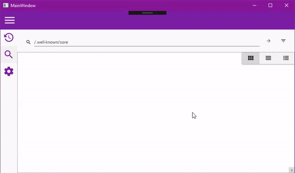

# CoAP Explorer

Work in Progress App for interacting with CoAP devices. Soon to be cross platform, for now, is targeting Windows.

Based on [ReactiveUI](https://github.com/reactiveui/ReactiveUI/), [Material Deisgn Toolkit](https://github.com/ButchersBoy/MaterialDesignInXamlToolkit) and my very own [CoAP.Net](https://github.com/NZSmartie/CoAP.Net/)

## Goals

 - Cross Platform
   - Using the same concepts from Xamarin Apps, the core functionality is in the schared project (Targeting .Net Standard)
 - Device Discovery
   - [X] UDP Multicast Discovery.
   - [ ] TODO: Suport more transports.
 - Send Messages

## Screen Grabs

